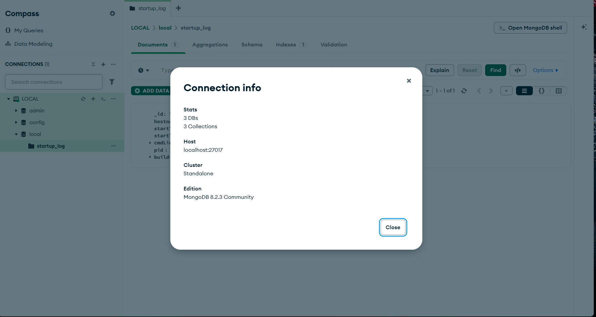
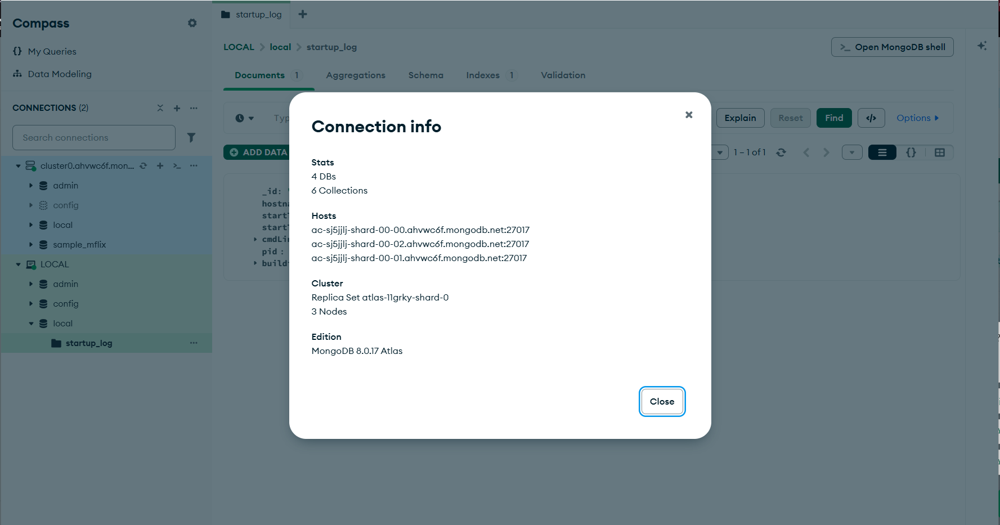
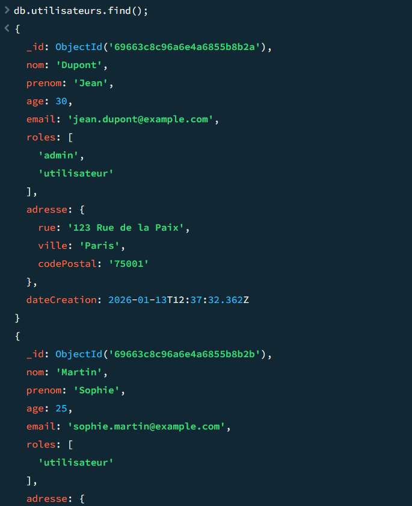
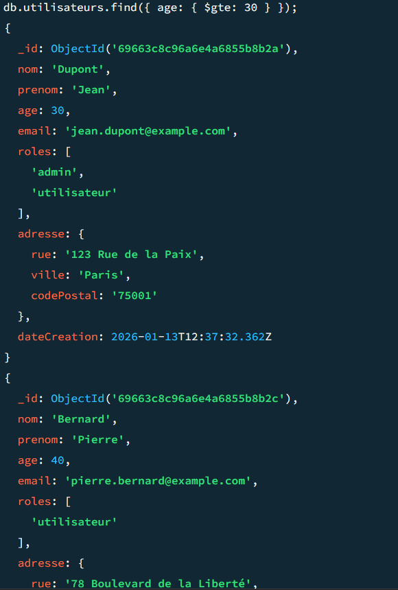
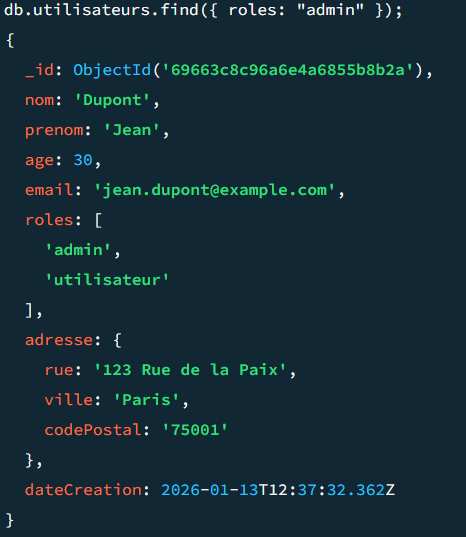

# Installation mongoDB local
## Connexion à la BDD local


## Connexion à la BDD Atlas


# Creation d'une collection et insertion de documents

```MongoDB
// Connexion à la base de données (exemple avec le shell MongoDB)
use local;

// Création d'une collection 'utilisateurs' et insertion de documents
db.utilisateurs.insertMany([
  {
    nom: "Dupont",
    prenom: "Jean",
    age: 30,
    email: "jean.dupont@example.com",
    roles: ["admin", "utilisateur"],
    adresse: {
      rue: "123 Rue de la Paix",
      ville: "Paris",
      codePostal: "75001"
    },
    dateCreation: new Date()
  },
  {
    nom: "Martin",
    prenom: "Sophie",
    age: 25,
    email: "sophie.martin@example.com",
    roles: ["utilisateur"],
    adresse: {
      rue: "45 Avenue des Champs",
      ville: "Lyon",
      codePostal: "69002"
    },
    dateCreation: new Date()
  },
  {
    nom: "Bernard",
    prenom: "Pierre",
    age: 40,
    email: "pierre.bernard@example.com",
    roles: ["utilisateur"],
    adresse: {
      rue: "78 Boulevard de la Liberté",
      ville: "Marseille",
      codePostal: "13005"
    },
    dateCreation: new Date()
  }
]);
```


# Récupération de données (plusieurs exemples)

```MongoDB
// Récupération de tous les documents de la collection 'utilisateurs'
db.utilisateurs.find();
```


```MongoDB
// Récupération des documents où l'âge est supérieur ou égal à 30
db.utilisateurs.find({ age: { $gte: 30 } });
```


```MongoDB
// Récupération des documents où le rôle est "admin" (il n'y en a qu'un seul)
db.utilisateurs.find({ roles: "admin" });
```
