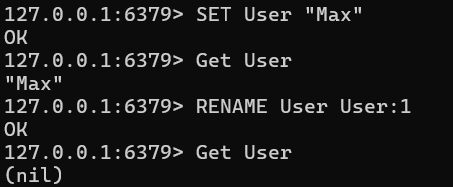
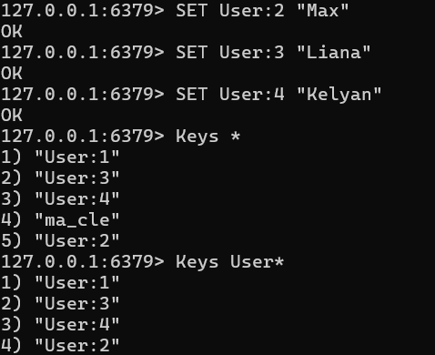
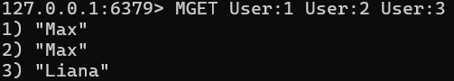
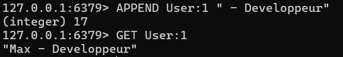
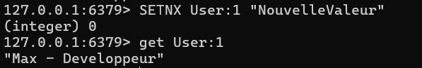
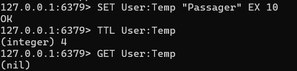
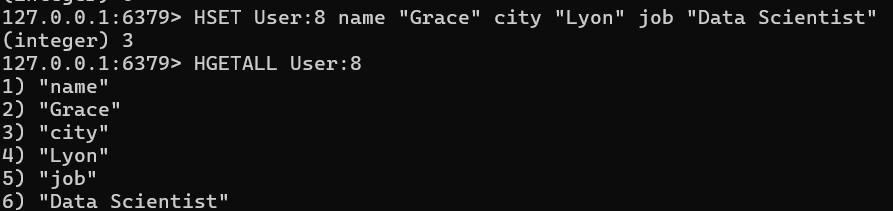
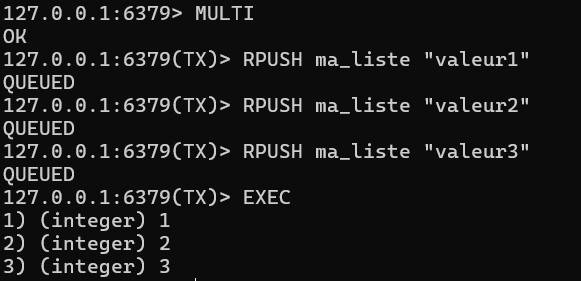

# TP5 - Utilisation de REDIS

## Exercice 1

1) Créé variable User et renommer avec User:1


2) Créer plusieurs clés utilisateurs (User:2, User:3, User:4) avec des valeurs différentes. Lister toutes les clés existantes, puis uniquement celles commençant par User. 


3) Afficher les valeurs de plusieurs clés en une seule opération. 


4) Modifier la valeur d’une clé existante en ajoutant du texte à la fin de sa valeur.


5) Tester une commande permettant de créer une clé uniquement si elle n’existe pas 
déjà, et expliquer le résultat obtenu.


6) Créer une clé temporaire User:Temp avec une durée de vie limitée. 
Vérifier son temps de vie restant, puis observer ce qu’il se passe après expiration. 


7) Simuler un utilisateur en créant plusieurs clés liées (User:6, User:6:City, User:6:Age, User:6:Activity) dont au moins une possède une durée de vie limitée.

```bash
SET User:6 "Eve"
SET User:6:City "Paris"
SET User:6:Age "30"
SET User:6:Activity "Running" EX 60
```

8) Tester une opération permettant de créer plusieurs clés de manière atomique 
uniquement si aucune d’elles n’existe déjà, et analyser le comportement obtenu.
```bash
MSETNX User:7 "Frank" User:1 "Doublon"
```
*Retourne (integer) 0. Comme User:1 existe déjà, aucune des clés n'est créée. L'opération est atomique : tout passe ou tout échoue.*

9) Créer un utilisateur en utilisant une structure de type Hash, puis afficher la liste des champs et des valeurs.


10) Créer une liste Redis, y insérer plusieurs valeurs, puis effectuer ces opérations dans une transaction Redis.
